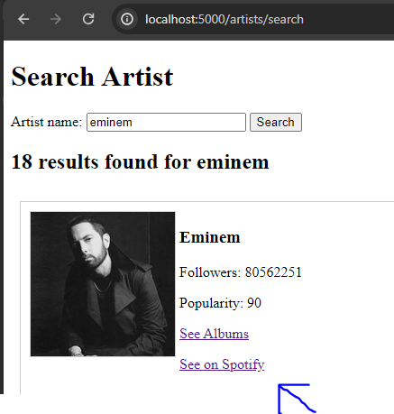
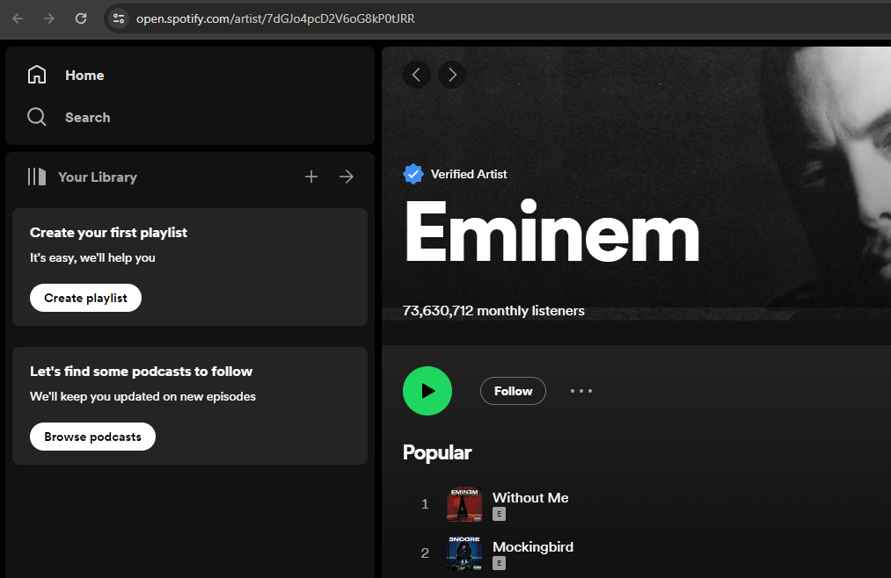
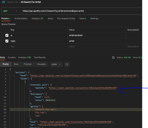
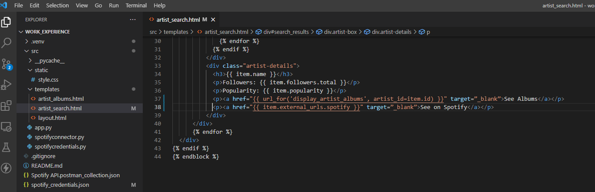

# Add external link to Spotify on the Artist search page results

### High level overview

On the artist search page result, we want to add a link that will bring us the artist page on Spotify.

  


### Step by step solution
Use the Spotify API and Postman to source the URL that will be required.

The application is using the /search endpoint to search by artist and we can see that it returns an external URL to Spotify under external_urls.spotify.



The artist_search.html template has access to all the values for each item in the main for loop. Therefore the link can be added using the markup

```
<a class="a-album" href="{{ item.external_urls.spotify }}" target=”_blank”>See on Spotify<a>
```

The paragraph tag can be used to adjust the layout.



The app shouldn't need to be restarted. Just perform a new search and the link should appear.
