# 1 Test API requests in Postman

In Postman, click on Workspaces → Create Workspace.

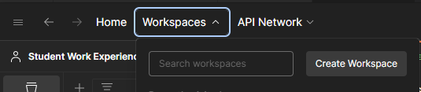

Leave Blank workspace selected, click on Next.

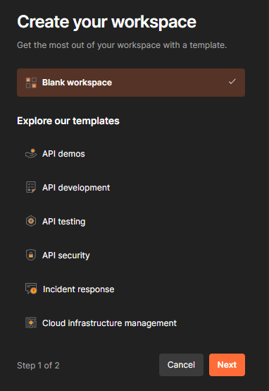

Call it Spotify API, leave Personal selected, click on Create.

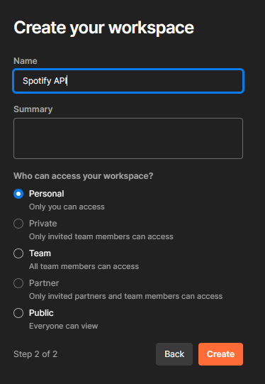

Click on Import.

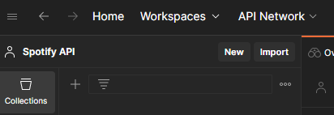

Click on files.

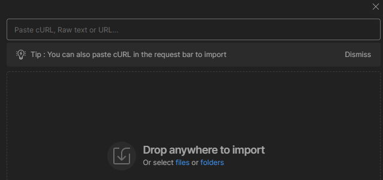

Select "Spotify API.postman_collection.json" in the root folder of the project, click on Open.

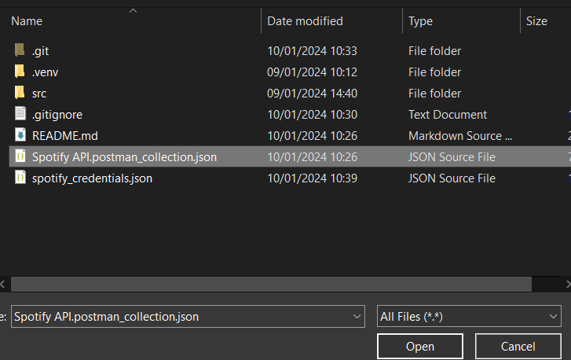

Click on Environments and then on the + icon to create a new one.

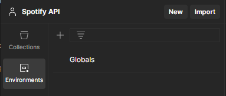

Call it Spotify Tests.

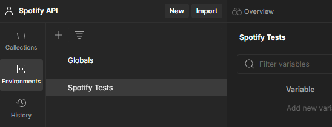

Go back to collections:

1. Select Spotify Tests as Environment
2. Set the Client ID and Secret in the Body of the request
3. Click on Send

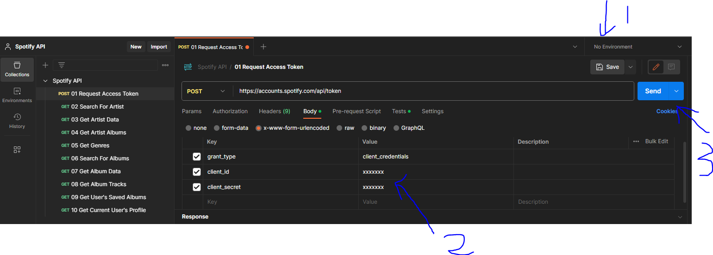

If the request was successful then you should get an access token back:

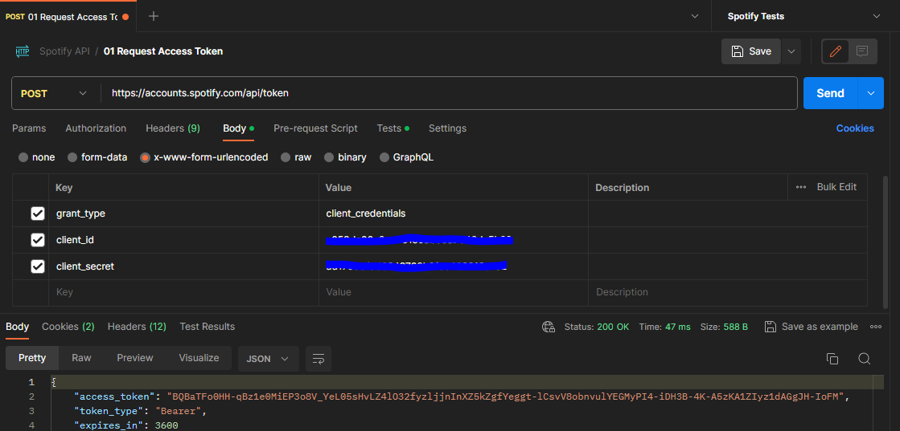

And it should automatically be populated in the Spotify Tests environment:

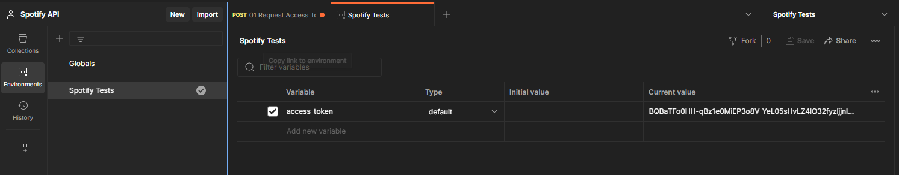

You can now explore the Spotify API using the documentation https://developer.spotify.com/documentation/web-api. Basic requests are included in the Postman collection.

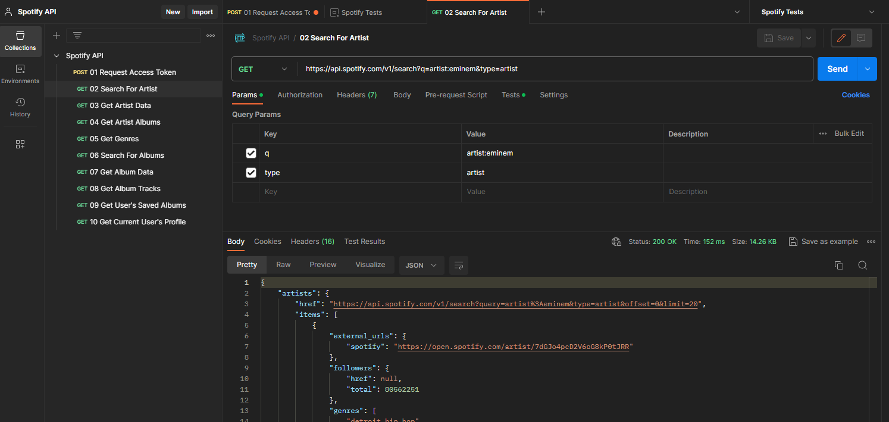