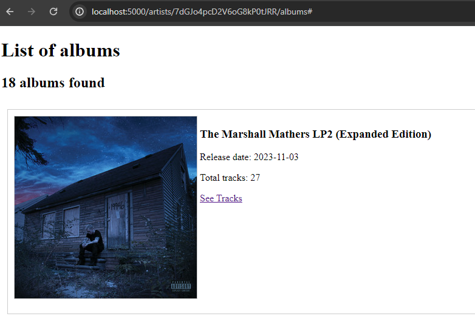
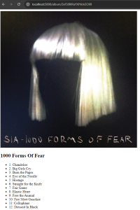
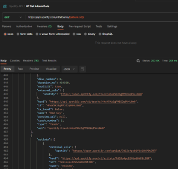

# Implement page to view album details

### High level overview

Clicking on "See Tracks" on the Albums page doesn't do anything.




Implement a Album Details page that will display a picture of the album and its tracks. This new page will be accessed from the "See Tracks" link.

This will require:

1. Finding an adequate request in the Spotify API
2. Adding this new API call to spotifyconnector.py
3. Creating a new html template to display the album's tracks
4. Creating  new route in app.py to handle GET "/album/<album_id>" requests
5. Updating the artist_albums.html template to point at this new page

### Step by step solution

Explore the Spotify API and find a request suitable for this requirement.

GET v1/albums/{{album_id}} appear to contain everything required.



Update spotifyconnector.py to implement this new API call. It should take an album_id as a string parameter and return album details. Look at get_albums_by_artist_id for an example.

```
def get_album_data(self, album_id):
    # Make sure we have a valid token
    self.check_token()
 
    url = self.api_base_url + f'/albums/{album_id}'
 
    # GET request to get album details
    # see https://developer.spotify.com/documentation/web-api/reference/get-an-album
    logging.info(f'Sending GET request to get album from ID: {album_id}')
    response = requests.get(url, headers=self.build_headers_with_auth_token())
 
    # If the request failed for whatever reason then log the response
    if response.status_code == 200:
        json_response = response.json()
        logging.info(f'Search by album ID request successful')
        return json_response
    else:
        logging.warn(f"Could not get album by ID {response.status_code}:")
        logging.warn(response.text)
        return None
```

Create a new template called album.html. Look at existing templates in the project for example. Use the response you got in Postman as reference to find out how to display the data. For this page, the image with the highest resolution could be used (640x640) and tracks could be displayed using the ul/li html tags. Here is an example of how it could be done:

```

Album Details

  {{ super() }}



  <div id="album_details">
      <div>
        
          
            
              
            
          
        
      </div>
      <div>
        <h2>{{ album_details.name }}</h2>
        <ul>
          
            <li>{{ track.track_number }}: {{ track.name }}</li>
          
        </ul>
      </div>
  </div>


```

Add a new routing in app.py in order to call the function we just created to make this new API call and use the new template to display the results:

```
@app.route('/album/<album_id>', methods=['GET'])
def display_album_details(album_id):
 
    # Read the album ID from the request path
    album_details = spotify_connector.get_album_data(album_id)
 
    # This is a hack to copy the items array into a new array because jinja2 confuses it with the items() dictionary function
    album_details['track_items'] = album_details['tracks']['items']
 
    return render_template('album.html', album_details=album_details)
```

In the artist_album.html template, update the "See Tracks" link in order to point at the new page.

```
<a href="{{ url_for('display_album_details', album_id=item.id) }}" target=”_blank”>See Tracks</a>
```